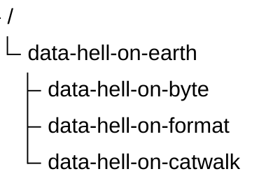

# hell-data-on-earth
Apresentação para a Série `R_Brasil |> bate::papo()` da Comunidade R Brasil no Telegram

## Teste

```mermaid
treeView-beta
  "data-hell-on-earth"
    "data-hell-on-byte"
    "data-hell-on-format"
    "data-hell-on-catwalk"
```

